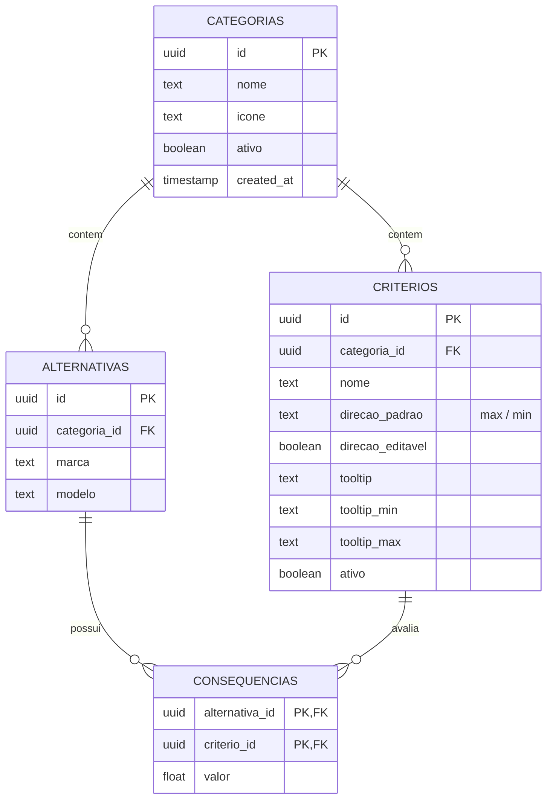

# Especificação de Requisitos: recomendAI

Este documento define os requisitos funcionais, não-funcionais e a arquitetura básica do sistema **recomendAI**, uma plataforma de recomendação interativa orientada por chatbot e gerida por um Painel Administrativo.

---

## 1. Visão Geral
O **recomendAI** é uma solução Web que ajuda os usuários a tomarem decisões de compra complexas (como a escolha de notebooks, smartphones, TVs, etc.) por meio de uma conversa interativa com um assistente virtual (chatbot). O assistente coleta as preferências e pesos do usuário para diferentes critérios e, utilizando um algoritmo de decisão multicritério, ordena e recomenda as melhores alternativas de produtos disponíveis no banco de dados.

---

## 2. Premissas Tecnológicas

O sistema deve obedecer rigorosamente às seguintes premissas de engenharia:
- **Tecnologias Core**: Construído integralmente com **HTML5**, **JavaScript (ES6+) Vanilla** e **CSS3 Vanilla** para máxima leveza e compatibilidade.
- **Conectividade**: A persistência de dados, autenticação de usuários e operações CRUD são integradas diretamente ao **Supabase** via Client SDK JavaScript.
- **Design System**: Estilo visual moderno com **Glassmorphism**, suporte nativo a temas Claro/Escuro (Light/Dark Mode), transições fluidas e micro-animações (usando a biblioteca de ícones *Lucide*).
- **Sem Servidor Dedicado**: Toda a lógica de negócio roda no lado do cliente (Client-Side), conectando-se diretamente às APIs do Supabase.

---

## 3. Módulos do Sistema

### 3.1. Autenticação e Usuários
- **Cadastro de Usuários**: Tela para novos usuários se registrarem com nome completo, e-mail e senha.
- **Login e Sessão**: Controle de acesso seguro integrado com o Supabase Auth.
- **Temas**: Alternância global de tema claro/escuro persistente.

### 3.2. Chatbot e Tomada de Decisão (Área do Usuário)
- **Menu de Categorias**: Usuário escolhe a categoria de produto na qual deseja uma recomendação (ex: Notebooks).
- **Entrevista Interativa (Wizard)**: O robô (Patinho Atendente) faz perguntas sobre o peso ou importância de cada critério cadastrado (ex: Peso, Preço, Bateria).
- **Cálculo Multicritério**: O sistema roda no frontend um algoritmo de apoio à decisão multicritério (solver matemático local) cruzando as preferências do usuário com a matriz de consequências.
- **Painel de Recomendação (Ranking)**: Apresentação gráfica e textual dos melhores produtos ordenados por aderência às necessidades do usuário.

### 3.3. Painel Administrativo (Área do Gestor)
Interface para o administrador configurar as regras de negócio de cada categoria de recomendação.

- **Gerenciamento de Categorias**:
  - Cadastro, reordenação (via Drag & Drop), edição e exclusão de categorias.
  - Seleção visual de ícones representativos em formato de "teclado de ícones" (Lucide) com busca em português.
  - Alteração rápida de status (Ativo/Inativo) diretamente na tabela de listagem via combobox interativo.
- **Gerenciamento de Critérios**:
  - Cadastro dos critérios avaliados em cada categoria.
  - Configuração da direção de otimização (Maximizar ou Minimizar) e se o critério é editável ou não pelo usuário no chat.
  - Definição de tooltips informativos em português.
- **Gerenciamento de Alternativas**:
  - Cadastro de marcas e modelos que concorrem na categoria.
- **Matriz de Consequências (Especificações)**:
  - Tabela dinâmica que cruza as alternativas com os critérios de uma categoria.
  - Permite a edição inline dos dados técnicos de desempenho e salvamento em lote no banco.

---

## 4. Requisitos Funcionais (RF)

### 4.1. Módulo Administrativo (Admin)
- **RF-001**: O sistema deve exibir as categorias cadastradas em uma tabela com colunas para reordenação, Nome, Ícone, Status e Ações.
- **RF-002**: O status de uma categoria deve ser editado diretamente na tabela através de um combobox tipo badge que muda de cor (verde para "Ativo" e cinza para "Inativo") e salva imediatamente no Supabase.
- **RF-003**: No modal de criar/editar categoria, o administrador deve poder selecionar o ícone de forma visual através de um grid de ícones rápidos (Lucide).
- **RF-004**: O modal de ícones deve incluir uma barra de pesquisa que permita filtrar os ícones digitando termos em português (ex: "computador" exibe o ícone `laptop`).
- **RF-005**: Ao clicar em Editar categoria, a opção de alterar status não deve ser exibida no modal (visto que a alteração é feita diretamente na tabela de categorias).
- **RF-006**: O administrador deve poder reordenar fisicamente a ordem das categorias arrastando as linhas da tabela (drag and drop), salvando a ordem localmente.

### 4.2. Módulo Chatbot (Usuário)
- **RF-007**: O chatbot deve carregar dinamicamente apenas as categorias que estiverem marcadas como "Ativo" no painel admin.
- **RF-008**: O chatbot deve guiar o usuário em português e apresentar explicações (tooltips) sobre o significado de cada critério.

---

## 5. Requisitos Não-Funcionais (RNF)
- **RNF-001 (Usabilidade)**: A interface deve ser responsiva e adaptada para dispositivos móveis e desktops.
- **RNF-002 (Segurança)**: As páginas do Painel de Admin (`admin.html`) devem validar a sessão ativa no Supabase no carregamento da página, redirecionando usuários não autenticados para `login.html`.
- **RNF-003 (Performance)**: Carregamento assíncrono de dados e exibição de loaders de esqueleto (skeleton screens) enquanto as tabelas e dados são carregados do Supabase.

---

## 6. Modelagem de Dados (Tabelas do Supabase)

O banco de dados Supabase é composto por 4 tabelas fundamentais relacionais:

